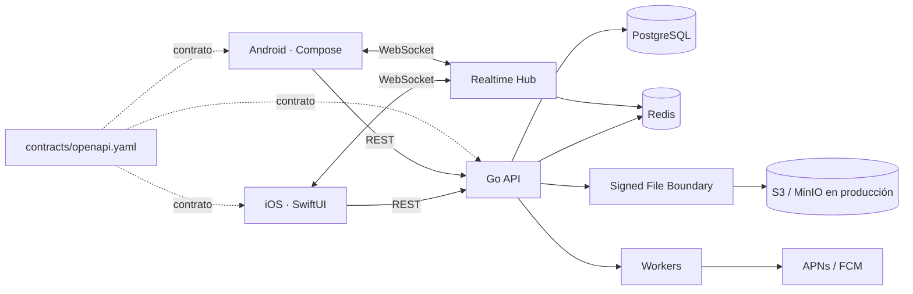

# PIXEL GO — Compartir entre dispositivos, nativo de verdad

[English](README.md) · [Español](README.es.md)

> **MÁNDALO. RECÍBELO DONDE QUIERAS.**  
> PIXEL GO es un sistema para mover **archivos, fotos, links, texto y clipboard** entre iPhone y Android con dos clientes nativos independientes y un solo contrato de compatibilidad.


## El producto

AirDrop funciona increíble cuando todo vive dentro del mismo ecosistema. PIXEL GO explora el problema de ingeniería que aparece cuando no.

```text
iPhone                                      Pixel

                PIXEL GO
                Copy / Send
                   photo
                     ↓
             signed upload URL
                     ↓
                 SHA-256
                     ↓
              transfer.ready
                     ├──────── WebSocket ────────→
                     └──────── push wake-up ────→
                                                   ↓
                                                download
                                                   ↓
                                             verifica SHA-256
                                                   ↓
                                              Delivered ✓
```

La superficie visible es pequeña a propósito. Eso permite profundizar en lo que está debajo: lifecycle nativo, background work, retries seguros, realtime, integridad binaria, contratos compatibles hacia atrás y CI/CD.

## Un producto. Dos apps nativas.

PIXEL GO comparte **cero implementación de UI** entre plataformas.

```text
                         PIXEL GO API
                              │
                       OpenAPI Contract
                         ↙          ↘
                 Swift client    Kotlin client
                      ↓               ↓
                  SwiftUI App     Compose App
```

| Problema | iOS | Android |
|---|---|---|
| Lenguaje | Swift | Kotlin |
| UI | SwiftUI | Jetpack Compose |
| Async | Swift Concurrency | Coroutines |
| Networking | URLSession | frontera HTTP nativa |
| Credenciales | Keychain | Android Keystore |
| Push | APNs | FCM |
| Background | BackgroundTasks | WorkManager |
| Persistencia | frontera nativa | Room |
| Lifecycle | app / scene lifecycle | activity / process lifecycle |

Actualmente ambas apps cargan dispositivos registrados y transferencias recientes desde **el mismo backend Go**, pero siguen siendo implementaciones completamente separadas.

## Lifecycle real de transferencia

```text
Register iPhone
     ↓
Register Android
     ↓
POST /v1/transfers
     ↓
URL de upload firmada y con expiración
     ↓
PUT de bytes reales
     ↓
servidor valida tamaño + SHA-256
     ↓
POST /uploaded
     ↓
URL de download firmada y con expiración
     ↓
GET de los mismos bytes
     ↓
verifica SHA-256
     ↓
POST /complete
     ↓
Delivered ✓
```

Para desarrollo local y CI, el adapter actual guarda los bytes en memoria detrás de URLs firmadas. La frontera está separada para reemplazar ese adapter por MinIO/S3 en producción sin cambiar las reglas del dominio de transferencias.

## Idempotencia y retries móviles

Un timeout móvil puede ocurrir después de que el servidor sí procesó el request. Reintentar ciegamente puede duplicar una transferencia.

PIXEL GO ya implementa `Idempotency-Key` para mutaciones POST:

- misma key + mismo request → replay del resultado original;
- misma key + request diferente → `409 idempotency_key_reused`;
- retries concurrentes iguales se **coalescen** y sólo una mutación se ejecuta;
- un 5xx no queda guardado como operación exitosa;
- un replay responde con `Idempotency-Replayed: true`.

Hoy el store de idempotencia vive en memoria. En producción distribuida debe moverse a Redis/PostgreSQL para sobrevivir reinicios y coordinar múltiples réplicas.

## Arquitectura



El backend sigue la idea de **modular monolith**. No hay microservicios inventados sólo para hacer el diagrama más impresionante.

## Contrato API

`contracts/openapi.yaml` es la frontera de compatibilidad entre software que no se despliega al mismo ritmo.

API pública actual:

```text
GET    /health

GET    /v1/devices
POST   /v1/devices
DELETE /v1/devices/{deviceId}

POST   /v1/transfers
GET    /v1/transfers
GET    /v1/transfers/{transferId}
POST   /v1/transfers/{transferId}/uploaded
POST   /v1/transfers/{transferId}/complete

GET    /v1/events
```

El servidor de desarrollo además expone `/dev-upload/{id}` y `/dev-download/{id}` mediante URLs firmadas. Son parte del adapter local, no una afirmación de cómo se servirían archivos en producción.

CI valida la estructura OpenAPI y en Pull Requests compara el contrato contra la base para detectar cambios incompatibles.

## iOS nativo

La implementación actual incluye:

- Swift 6 + SwiftUI;
- API client actor-based con `URLSession`;
- devices y transfers reales desde backend;
- Keychain;
- BackgroundTasks;
- frontera de permisos de notificaciones;
- modelos de dominio;
- XCTest;
- XcodeGen;
- aislamiento correcto para Swift 6 Concurrency.

## Android nativo

La implementación actual incluye:

- Kotlin + Jetpack Compose;
- Coroutines;
- devices y transfers reales desde el mismo backend;
- Android Keystore;
- WorkManager;
- frontera Room;
- dependencia FCM;
- JUnit;
- AndroidX configurado explícitamente.

**Mismo producto. Cero UI compartida.**

## Seguridad de transferencia

Las URLs locales están firmadas con HMAC-SHA256 sobre:

- acción;
- transfer ID;
- expiración.

El upload valida además:

1. que la transferencia siga en estado de upload;
2. que el número de bytes coincida exactamente con `sizeBytes`;
3. que SHA-256 coincida con la metadata.

Sólo entonces puede pasar a `ready`.

Esto **todavía no es cifrado end-to-end**. Hoy SHA-256 demuestra integridad y TLS protege el transporte. E2EE de contenido es un milestone de seguridad separado.

## CI/CD

```text
                         PR / PUSH
                             ↓
                 OpenAPI structural validation
                             ↓
              ┌──────────────┼──────────────┐
              ↓              ↓              ↓
        SwiftUI tests    Compose tests     Go vet
        iOS build        Android build     Go -race tests
              │              │              ↓
              │              │       binary E2E lifecycle
              └──────────────┴──────────────┤
                                             ↓
                                      Docker image build
```

En Pull Requests también se ejecuta validación de cambios incompatibles del contrato.

Los release tags generan artifacts independientes para backend, Android e iOS. Las credenciales reales de tiendas y producción no se inventan ni se guardan en source control.

## Testing con intención

Ya se prueban invariantes importantes:

- transiciones del state machine;
- no completar antes de `ready`;
- validación de firma HMAC;
- rechazo de URL manipulada;
- replay idempotente;
- conflicto por reutilizar una key con otro payload;
- coalescing de retries concurrentes;
- retry después de 5xx;
- upload de bytes reales;
- validación de tamaño;
- validación SHA-256;
- download de exactamente los mismos bytes;
- estado final `completed`.

El E2E de CI simula los roles iPhone/Android a través del API. **Todavía no afirma automatización sobre dos dispositivos físicos.**

## Estado actual

**Implementado hoy:**

- OpenAPI versionado;
- SwiftUI nativo;
- Compose nativo;
- ambas apps leyendo el mismo backend;
- backend Go;
- state machine de transfers;
- WebSocket hub;
- URLs firmadas HMAC con expiración;
- upload/download binario real en local;
- validación de tamaño y SHA-256;
- idempotencia con coalescing concurrente;
- Keychain / Keystore;
- BackgroundTasks / WorkManager;
- schema PostgreSQL;
- Postgres + Redis + MinIO para entorno local;
- CI multiplataforma;
- E2E binario real;
- workflows de release;
- documentación EN/ES.

**Todavía no se presume como terminado:**

- auth + refresh rotation;
- repositorios PostgreSQL conectados al runtime;
- presence/idempotencia distribuidas con Redis;
- adapter productivo de signed URLs S3/MinIO;
- APNs / FCM reales;
- clientes Swift/Kotlin generados desde OpenAPI;
- E2E automatizado sobre iPhone físico → Android físico;
- distribución real TestFlight / Play con credenciales.

PIXEL GO no intenta demostrar 40 features.

Intenta demostrar que una idea sencilla puede ejecutarse con **profundidad de ingeniería**.

**Un producto. Dos apps nativas. Un contrato.**
