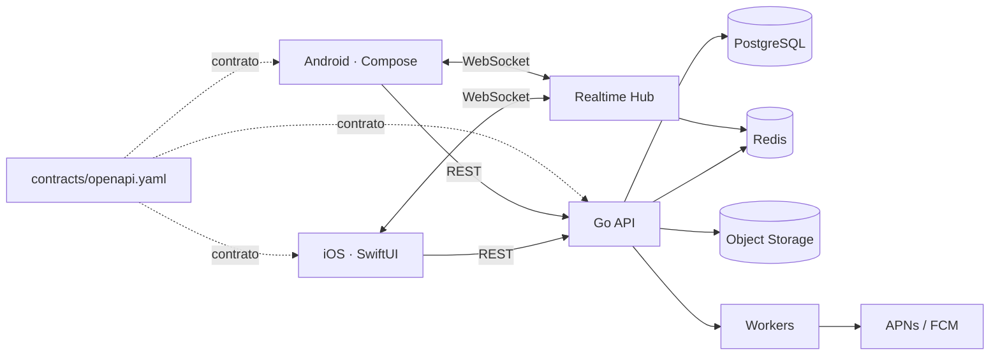

# PIXEL GO — Compartir entre dispositivos, nativo de verdad

[English](README.md) · [Español](README.es.md)

> **MÁNDALO. RECÍBELO DONDE QUIERAS.**  
> PIXEL GO es un sistema para mover **archivos, fotos, links, texto y clipboard** entre tus propios dispositivos iPhone y Android de forma rápida, segura y nativa.


## El producto

PIXEL GO parte de una pregunta muy simple:

> **¿Qué pasa cuando quieres la experiencia de “mándalo al otro dispositivo” pero tus dispositivos no viven en el mismo ecosistema?**

El usuario inicia sesión, registra sus dispositivos y puede mandar contenido de uno a otro.

```text
iPhone                         Pixel

        PIXEL GO
        Copy / Send
           photo
             ↓
      encrypted transfer
             ↓
                               notification
                                    ↓
                               received ✓
```

La superficie visual puede ser mínima. El reto de ingeniería vive debajo: identidad de dispositivos, presencia, uploads directos, eventos realtime, background work, notificaciones, integridad, reintentos y compatibilidad entre versiones.

## Dos apps nativas, cero UI compartida

PIXEL GO **no** usa Flutter ni React Native.

```text
                         PIXEL GO API
                              │
                       OpenAPI Contract
                         ↙          ↘
                 Swift client    Kotlin client
                      ↓               ↓
                  SwiftUI App     Compose App
```

| Problema | iOS | Android |
|---|---|---|
| Lenguaje | Swift | Kotlin |
| UI | SwiftUI | Jetpack Compose |
| Async | Swift Concurrency | Coroutines |
| Credenciales | Keychain | Android Keystore |
| Push | APNs | FCM |
| Background | BackgroundTasks | WorkManager |
| Persistencia | frontera nativa | Room |
| Lifecycle | app/scene lifecycle | activity/process lifecycle |

**Mismo producto. Dos implementaciones nativas.**

Eso hace que las diferencias reales entre plataformas formen parte del proyecto y de la conversación técnica.

## Lifecycle de una transferencia

```text
emisor
  │
  ├── POST /v1/transfers
  │        ↓
  │   autorización de upload
  │        ↓
  ├── payload → object storage
  │        ↓
  │   POST /v1/transfers/{id}/uploaded
  │        ↓
backend emite transfer.ready
  │
  ├── WebSocket → destino conectado
  └── push       → destino dormido/offline
                           ↓
                       descarga
                           ↓
                    valida SHA-256
                           ↓
              POST /v1/transfers/{id}/complete
                           ↓
                    Delivered ✓
```

La transferencia es una máquina de estados:

```text
created → uploading → ready → downloading → completed
    └──────────────→ failed ←────────────────┘
```

Esto permite razonar sobre reintentos, idempotencia y fallos parciales en lugar de tratar todo como un único request.

## Arquitectura



El backend está planteado como **modular monolith**, no como una colección artificial de microservicios.

Módulos conceptuales:

- Auth
- Devices
- Transfers
- Presence
- Notifications
- Files
- Platform/infrastructure

PostgreSQL guarda estado durable. Redis está reservado para presencia, coordinación efímera y rate limiting. El contenido binario debe ir directo a object storage mediante URLs firmadas.

## El contrato importa

`contracts/openapi.yaml` es la frontera entre tres piezas que se despliegan con ritmos diferentes.

Una web puede actualizar frontend y backend casi al mismo tiempo. Mobile no tiene esa garantía: pueden existir teléfonos con una versión anterior durante semanas o meses.

Por eso PIXEL GO trata un cambio incompatible de API como un problema de CI, no como un detalle de documentación.

## Repo

```text
pixelgo/
├── ios/                         # Swift / SwiftUI
├── android/                     # Kotlin / Compose
├── server/                      # Go modular monolith
├── contracts/
│   └── openapi.yaml
├── infrastructure/
│   ├── docker-compose.yml
│   └── postgres/
├── docs/
├── tests/
└── .github/
    └── workflows/
```

## iOS

La base iOS incluye:

- SwiftUI;
- Swift Concurrency;
- `URLSession`;
- Keychain;
- BackgroundTasks;
- permisos de notificaciones;
- modelos de transferencia;
- tests de decoding;
- proyecto reproducible con XcodeGen.

## Android

La base Android incluye:

- Kotlin;
- Jetpack Compose;
- Coroutines;
- Android Keystore;
- WorkManager;
- frontera de persistencia Room;
- dependencia FCM preparada;
- tests JUnit.

No se comparte implementación de UI entre plataformas.

## Backend

La primera implementación ya contiene:

- servicio HTTP en Go;
- endpoints de health, devices y transfers;
- estado explícito de transferencias;
- WebSocket event hub;
- validación básica de payload;
- test del lifecycle;
- schema PostgreSQL;
- Dockerfile;
- Postgres + Redis + MinIO para desarrollo local.

La persistencia de runtime sigue usando repositorio in-memory en esta primera base. Conectar PostgreSQL, Redis y URLs firmadas de MinIO/S3 es un siguiente milestone explícito, no algo fingido en el README.

## CI/CD

Cada PR debe probar las fronteras importantes:

```text
PR
 ↓
OpenAPI lint / compatibility
 ↓
┌──────────────────────────────┐
│                              │
iOS build + tests      Android build + tests
│                              │
└──────────────┬───────────────┘
               ↓
          Backend tests
               ↓
          Docker build
               ↓
             PASS ✓
```

Los tags de release generan artifacts independientes para backend, iOS y Android. La publicación real en TestFlight/Play y el deploy productivo requieren credenciales reales y por eso no se inventan dentro del repo.

## Testing con intención

El objetivo no es presumir cientos de tests triviales. Los tests de mayor valor deben cubrir invariantes del producto:

- no completar antes de subir;
- no entregar a un dispositivo no autorizado;
- el checksum descargado debe coincidir;
- repetir un request idempotente no debe duplicar transferencias;
- perder el WebSocket no debe perder la entrega;
- el push es wake-up, no transporte del archivo;
- una versión mobile anterior debe seguir entendiendo el contrato compatible.

Objetivo E2E:

```text
Create user
  ↓
Register iPhone
  ↓
Register Android
  ↓
Create transfer on iPhone
  ↓
Upload
  ↓
Android receives event
  ↓
Download
  ↓
SHA-256 validation
  ↓
Mark delivered
  ↓
PASS
```

## Desarrollo local

Infraestructura:

```bash
docker compose -f infrastructure/docker-compose.yml up -d
```

Backend:

```bash
cd server
cp .env.example .env
go test ./...
go run ./cmd/api
```

iOS:

```bash
cd ios
brew install xcodegen
xcodegen generate
open PixelGo.xcodeproj
```

Android:

```bash
cd android
gradle :app:testDebugUnitTest
gradle :app:assembleDebug
```

Más detalle: [docs/LOCAL_DEVELOPMENT.md](docs/LOCAL_DEVELOPMENT.md).

## Estado actual

**Implementado:**

- contrato OpenAPI versionado;
- backend Go base;
- lifecycle de transferencias;
- WebSocket hub;
- SwiftUI client foundation;
- Compose client foundation;
- Keychain / Keystore;
- BackgroundTasks / WorkManager;
- esquema PostgreSQL;
- Postgres + Redis + MinIO local;
- CI base;
- documentación EN/ES.

**Siguiente milestone:**

- auth con access + refresh rotation;
- repositories PostgreSQL reales;
- presence distribuida con Redis;
- URLs firmadas de object storage;
- APNs y FCM reales;
- clientes Swift/Kotlin generados/modelados desde OpenAPI;
- E2E iPhone → Android en CI;
- distribución interna automatizada.

PIXEL GO no intenta demostrar 40 features.

Intenta demostrar que una idea pequeña puede ejecutarse con profundidad de ingeniería.

**Un producto. Dos apps nativas. Un contrato.**
