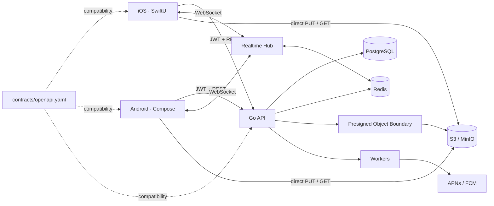

<p align="center"></p>

<p align="center"><strong>Native sharing, without the ecosystem walls.</strong><br/><sub>SEND IT. PICK IT UP ANYWHERE.</sub></p>

<p align="center"><a href="README.md">English</a> · <a href="README.es.md">Español</a></p>

<p align="center">
 <a href="https://github.com/armaabetancourtt/pixelgo/actions/workflows/ci.yml"></a>
 
 
 
 
 
</p>

> **SEND IT. PICK IT UP ANYWHERE.** PixelGo moves files, photos, links, text and clipboard content between iPhone and Android. Two native clients, one versioned contract, and an engineering focus on delivery, security and integrity.

---

## Official brand identity

PixelGo's visual system follows the approved logo: **rounded white custom lettering and its four-point sparkle** over a luminous pastel aurora. The palette moves between sky blue, violet, pink and aqua; the rest of the interface stays light, legible and restrained.

| Token | Value | Role |
| --- | --- | --- |
| Sky | `#8FB9FF` | Gradient foundation |
| Violet | `#AD8BFA` | Primary UI accent |
| Pink | `#FF9DDE` | Warm gradient accent |
| Aqua | `#64DDF9` | Cool gradient accent |
| Mint | `#A6F7EF` | Secondary glow |
| Ink | `#1B2142` | Accessible dark text |
| White | `#FFFFFF` | Original logo lettering |

The [official traced wordmark](brand/pixelgo-wordmark.svg), [pastel README banner](brand/pixelgo-banner.svg) and [app icon](brand/pixelgo-icon.svg) live in this repo, with usage rules in the [brand guide](brand/README.md). These are vector adaptations of the artwork provided for this update, not generic retypeset text. The two native clients reuse the same brand tokens and mark.

## The product

AirDrop is excellent when every device lives inside one ecosystem. PIXEL GO explores the engineering problem that appears when they do not.

```text
iPhone                                      Pixel

                PIXEL GO
                Copy / Send
                   photo
                     ↓
             signed upload URL
                     ↓
                 SHA-256
                     ↓
              transfer.ready
                     ├──────── WebSocket ────────→
                     └──────── push wake-up ────→
                                                   ↓
                                                download
                                                   ↓
                                             verify SHA-256
                                                   ↓
                                              Delivered ✓
```

The visible product stays deliberately small. That leaves room to go deep on the parts that are easy to list on a résumé and much harder to make coherent in a real system:

- two genuinely native mobile implementations;
- account and resource isolation;
- short-lived access tokens and rotating refresh tokens;
- ambiguous mobile retries and idempotency;
- durable state versus ephemeral presence;
- realtime delivery across multiple API replicas;
- signed binary transfer URLs and integrity validation;
- backwards-compatible API evolution;
- CI/CD across Swift, Kotlin and Go.

## One product. Two native apps.

PIXEL GO intentionally shares **no UI implementation** between platforms.

```text
                         PIXEL GO API
                              │
                       OpenAPI Contract
                         ↙          ↘
                 Swift client    Kotlin client
                      ↓               ↓
                  SwiftUI App     Compose App
```

| Concern | iOS | Android |
|---|---|---|
| Language | Swift 6 | Kotlin |
| UI | SwiftUI | Jetpack Compose |
| Async | Swift Concurrency | Coroutines |
| Networking | URLSession actor | native HTTP + Coroutines |
| Session storage | Keychain | Android Keystore + encrypted local blob |
| Refresh coordination | actor-shared refresh task | coroutine Mutex |
| Push boundary | APNs | FCM |
| Background work | BackgroundTasks | WorkManager |
| Local data boundary | native persistence boundary | Room |
| Lifecycle | app / scene | activity / process |

Both apps now implement native sign-in / account creation, restore encrypted sessions, register the current device, maintain realtime presence, and send/receive **text, links, clipboard content, photos and files** through the same signed transfer lifecycle. Incoming binary payloads are verified before the user saves them locally and the transfer is marked Delivered. Access tokens refresh automatically without double-rotating refresh credentials.

**Same product semantics. Separate native codebases.**

## Authentication is part of the system, not a badge

PIXEL GO implements a real session model:

```text
email + password
      ↓
bcrypt password hash
      ↓
15 minute access JWT
      +
30 day opaque refresh token
      ↓
refresh token stored only as SHA-256 hash in PostgreSQL
      ↓
refresh rotates on every use
      ↓
reuse of an old refresh token
      ↓
entire token family revoked
```

Important properties:

- passwords are hashed with bcrypt;
- access tokens are HS256 JWTs with issuer, audience, expiry, subject and JTI;
- refresh tokens are opaque random values, never JWTs;
- only refresh-token hashes are stored server-side;
- rotation is transactional in PostgreSQL;
- reuse of an already-consumed refresh token is treated as a possible stolen-token signal and revokes the family;
- iOS stores the session in Keychain;
- Android encrypts the session with an AES-GCM key held by Android Keystore;
- resource repositories scope devices and transfers to the authenticated user;
- a user cannot create a transfer using another account's devices;
- WebSocket device identity and presence lookups are ownership-checked.

See [docs/AUTH.md](docs/AUTH.md).

## Transfer lifecycle

Transfers are modeled as explicit state instead of one giant upload request.

```text
created → uploading → ready → downloading → completed
    └──────────────→ failed ←────────────────┘
```

The executable local/CI flow is:

```text
Create account
     ↓
Register iPhone
     ↓
Register Android
     ↓
POST /v1/transfers
     ↓
receive expiring S3-compatible presigned PUT URL
     ↓
PUT bytes directly to object storage
     + signed X-Amz-Meta-Sha256
     ↓
POST /uploaded
     ↓
API HEADs object: exact size + SHA-256 metadata
     ↓
transfer.ready
     ↓
receive presigned GET URL
     ↓
GET the same bytes
     ↓
validate SHA-256
     ↓
POST /complete
     ↓
transfer.completed
     ↓
Delivered ✓
```

When `OBJECT_STORAGE_ENDPOINT` is configured, payload bytes bypass the Go API entirely: clients upload and download directly through S3-compatible presigned URLs. The upload signature requires `X-Amz-Meta-Sha256`; before a transfer can become `ready`, the API performs an object `HEAD` and verifies both exact size and the signed checksum metadata. CI executes this path against a real MinIO instance. An in-memory HMAC-signed adapter remains available only as an isolated local/test fallback.

## Retry safety across replicas

Mobile failures are ambiguous. A request can time out after the server already committed it.

PIXEL GO supports `Idempotency-Key` on POST mutations.

Current behavior:

- same user + same key + same request → replay original response;
- same key reused with a different request → `409 idempotency_key_reused`;
- concurrent identical retries are coalesced;
- 5xx responses are not committed as successful idempotency records;
- replayed responses include `Idempotency-Replayed: true`;
- idempotency keys are namespaced by authenticated user.

When Redis is configured, coordination is **cross-replica**. Two retries can hit two API instances and still execute the underlying mutation once. Redis uses an owner-scoped lock plus a replayable result record. If distributed idempotency is configured but Redis is unavailable, mutation coordination fails closed with `503` instead of risking a duplicate write.

## Architecture



### Durable versus ephemeral state

The split is executable, not just diagrammed.

**PostgreSQL**

- users;
- bcrypt password hashes;
- hashed refresh-token families;
- registered devices;
- transfer metadata and lifecycle state.

**Redis**

- device presence TTLs;
- realtime Pub/Sub fan-out across API replicas;
- cross-replica idempotency locks and replay records;
- shared fixed-window rate limits.

**Object storage**

- S3-compatible presigned PUT/GET capabilities;
- payload bytes move directly between mobile clients and object storage;
- the PUT signature binds `X-Amz-Meta-Sha256`;
- the API validates object size + checksum metadata with `HEAD` before `transfer.ready`;
- a local in-memory adapter remains as a fallback when object storage is not configured.

Signed URLs are regenerated from transfer state and are deliberately **not persisted as durable credentials**.

## Realtime presence

A registered device is durable. Being online is not.

```text
WebSocket connects with owned deviceId
               ↓
        Redis presence key
            TTL = 45s
               ↓
         heartbeat refresh
               ↓
disconnect / TTL expiry
               ↓
            offline
```

Redis Pub/Sub lets a transfer event produced by one API replica reach the correct WebSocket client on another replica. Routing is explicit: transfer events target the relevant source/destination device, presence is scoped to the authenticated account, and realtime payloads never expose presigned storage capabilities.

## Rate limiting

Redis-backed fixed windows share request budgets across replicas. HTTP responses expose:

- `429 Too Many Requests`;
- `Retry-After`;
- `RateLimit-Limit`;
- `RateLimit-Remaining`.

Unlike idempotency, rate limiting is an abuse-control layer rather than a consistency boundary, so it intentionally fails open if Redis becomes unavailable.

## Repository layout

```text
pixelgo/
├── ios/                         # Swift 6 / SwiftUI
├── android/                     # Kotlin / Jetpack Compose
├── server/
│   ├── cmd/api/
│   └── internal/
│       ├── auth/
│       ├── devices/
│       ├── transfers/
│       ├── files/
│       ├── presence/
│       ├── realtime/
│       ├── ratelimit/
│       ├── httpapi/
│       └── platform/
├── contracts/
│   └── openapi.yaml
├── infrastructure/
│   ├── docker-compose.yml
│   └── postgres/
├── docs/
│   ├── ARCHITECTURE.md
│   ├── AUTH.md
│   ├── TRANSFER_LIFECYCLE.md
│   ├── SECURITY.md
│   └── LOCAL_DEVELOPMENT.md
├── tests/e2e/
└── .github/workflows/
```

## API contract

`contracts/openapi.yaml` is the compatibility boundary between software that cannot be deployed atomically.

Core routes:

```text
GET    /health

POST   /v1/auth/register
POST   /v1/auth/login
POST   /v1/auth/refresh

GET    /v1/devices
POST   /v1/devices
DELETE /v1/devices/{deviceId}
GET    /v1/presence/{deviceId}

GET    /v1/transfers
POST   /v1/transfers
GET    /v1/transfers/{transferId}
POST   /v1/transfers/{transferId}/uploaded
POST   /v1/transfers/{transferId}/complete

GET    /v1/events?deviceId=...    # authenticated WebSocket upgrade
```

Protected routes use the OpenAPI Bearer security scheme. Pull-request CI validates the contract and rejects incompatible API changes against the base revision.

## Native iOS

Implemented:

- Swift 6 + SwiftUI;
- actor-isolated API client;
- native login / register UI;
- Bearer authentication;
- automatic refresh-token rotation;
- concurrent refresh coalescing;
- Keychain session persistence;
- live API devices / transfers / presence;
- native PhotosPicker + fileImporter send flows;
- explicit native Paste & Send Clipboard action;
- direct binary upload to S3/MinIO through presigned PUT;
- verified incoming file/photo download and local save before completion;
- BackgroundTasks boundary;
- native APNs registration + device-token rotation sync;
- foreground notification presentation;
- XCTest + host contract tests;
- reproducible XcodeGen project.

## Native Android

Implemented:

- Kotlin + Jetpack Compose;
- Coroutines;
- native login / register UI;
- Bearer authentication;
- automatic refresh-token rotation;
- coroutine `Mutex` refresh coalescing;
- AES-GCM session encryption using Android Keystore;
- live API devices / transfers / presence;
- native Photo Picker + document picker send flows;
- explicit native Paste & Send Clipboard action;
- direct binary upload to S3/MinIO through presigned PUT;
- verified incoming file/photo download and Storage Access Framework save before completion;
- WorkManager boundary;
- Room persistence boundary;
- FCM token registration + onNewToken rotation sync;
- FirebaseMessagingService notification handling;
- JUnit;
- AndroidX build configuration.

## Durable push wake-up

Push is a fallback for devices that are not currently reachable through realtime.

```text
transfer becomes ready
        ↓
PostgreSQL transaction
        ├── transfer status = ready
        └── notification_outbox row
                    ↓
        worker claims with SKIP LOCKED
                    ↓
            check Redis presence
              ↙             ↘
         online             offline
           ↓                   ↓
   WebSocket already       APNs / FCM
     delivered event        wake-up
                                ↓
                       retry with backoff
```

Implemented properties:

- device push tokens can rotate independently through a user-scoped API endpoint;
- iOS registers APNs tokens and republishes rotations to the backend;
- Android syncs the current FCM token and handles `onNewToken`;
- the `transfer.ready` outbox row is created transactionally in PostgreSQL;
- multiple worker replicas claim work with `FOR UPDATE SKIP LOCKED`;
- online devices skip push because the WebSocket path is already active;
- transient provider failures retry with exponential backoff;
- permanent provider failures stop retrying;
- APNs uses token-based ES256 authentication over the HTTP/2 provider API;
- FCM uses the HTTP v1 API with service-account OAuth2;
- provider credentials are intentionally not committed.

## Observability

The backend exposes production-style operational signals without logging request bodies or authorization credentials.

- JSON structured logs via Go `slog`;
- `X-Request-ID` on every HTTP response;
- Prometheus/OpenMetrics at `GET /metrics`;
- request count, latency, response bytes and in-flight gauges;
- normalized route labels such as `/v1/transfers/{transferId}` to avoid high-cardinality resource IDs;
- explicit tests that ensure Bearer credentials never appear in request logs.

`PIXELGO_LOG_LEVEL` supports `debug`, `info`, `warn` and `error`.

## Security boundaries

Current transfer security:

- short-lived S3-compatible presigned PUT/GET URLs;
- a signed `X-Amz-Meta-Sha256` upload requirement;
- object `HEAD` validation before the lifecycle can advance to `ready`;
- exact byte-count verification;
- destination-side SHA-256 payload validation;
- HMAC-signed local transfer URLs only in fallback mode;
- user-scoped transfer metadata;
- access/refresh token separation;
- refresh-token family revocation.

This is **not yet end-to-end file encryption**. TLS protects transport and SHA-256 proves integrity in the current design. Content E2EE would be a separate cryptographic protocol and is not claimed here.

See [docs/SECURITY.md](docs/SECURITY.md).

## CI/CD

Every push / PR validates independently built software:

```text
                         PR / PUSH
                             ↓
                   OpenAPI validation
                             ↓
        ┌────────────────────┼────────────────────┐
        ↓                    ↓                    ↓
   iOS native build     Android build       Go vet + race
   Swift tests          JUnit tests       PostgreSQL + Redis + MinIO
        │                    │                    ↓
        │                    │          authenticated binary E2E
        │                    │                    ↓
        └────────────────────┴────────────── Docker build
```

The backend E2E runs with **authentication required**, PostgreSQL, Redis and MinIO enabled. It proves:

1. account creation;
2. unauthenticated requests are rejected;
3. user-scoped iPhone + Android registration;
4. retry-safe transfer creation;
5. direct presigned PUT to MinIO with signed SHA-256 metadata;
6. server-side object HEAD validation plus destination SHA-256 verification;
7. completed delivery state;
8. another account cannot see the devices or transfer;
9. refresh rotation;
10. old refresh-token reuse revokes the family;
11. durable authenticated metadata survives an API restart while object bytes remain in MinIO.

Release tags publish the backend image to GHCR with SBOM/provenance, build Android/iOS artifacts, and can promote the same immutable image through GitHub `staging` and `production` Environments. Staging and production are guarded by `/ready` smoke tests; production can require GitHub Environment reviewers. Real infrastructure/store credentials are intentionally not committed.

See [docs/DEPLOYMENT.md](docs/DEPLOYMENT.md).

## Testing philosophy

The goal is not a vanity test count. Tests target invariants that would hurt real users if broken:

- auth isolation;
- bcrypt credential verification;
- refresh reuse detection;
- transfer state transitions;
- signed URL tamper rejection;
- checksum and size mismatch;
- sequential and concurrent idempotency;
- cross-replica retry coordination;
- PostgreSQL restart persistence;
- Redis presence expiry;
- Redis Pub/Sub fan-out;
- shared rate-limit counters;
- mobile contract decoding;
- push worker retry/permanent-failure semantics;
- PostgreSQL notification-outbox trigger and exclusive claim behavior.

## Local development

Start infrastructure:

```bash
docker compose -f infrastructure/docker-compose.yml up -d
```

Backend:

```bash
cd server
cp .env.example .env
go mod tidy
go test ./...
go run ./cmd/api
```

To run the same security path as CI, set:

```bash
PIXELGO_REQUIRE_AUTH=true
```

Then run:

```bash
python3 tests/e2e/transfer_flow.py
curl http://localhost:8080/metrics
```

iOS:

```bash
cd ios
brew install xcodegen
xcodegen generate
open PixelGo.xcodeproj
```

Android:

```bash
cd android
gradle :app:testDebugUnitTest
gradle :app:assembleDebug
```

Full setup: [docs/LOCAL_DEVELOPMENT.md](docs/LOCAL_DEVELOPMENT.md).

## Current status

### Implemented

- native SwiftUI and Compose applications;
- native auth UI on both platforms;
- Keychain / Keystore-backed sessions;
- JWT access tokens + rotating opaque refresh tokens;
- refresh-token reuse family revocation;
- authenticated user/resource isolation;
- versioned OpenAPI contract;
- Go modular monolith;
- PostgreSQL runtime repositories;
- Redis presence, Pub/Sub, idempotency and rate limiting;
- WebSocket realtime hub;
- direct S3/MinIO presigned PUT/GET object storage;
- signed checksum metadata + object HEAD verification;
- exact-size and destination SHA-256 validation;
- local in-memory signed adapter fallback;
- native file/photo selection on iOS and Android;
- verified binary receive + explicit local save before Delivered;
- explicit cross-device clipboard transfers on both native clients;
- structured JSON request logs + request IDs;
- Prometheus/OpenMetrics HTTP metrics with bounded-cardinality labels;
- cross-replica retry safety;
- authenticated E2E lifecycle;
- cross-platform CI + workflow linting;
- GHCR backend image with SBOM/provenance;
- optional staging → readiness → production promotion;
- Android/iOS release artifacts;
- bilingual engineering documentation.

### Intentionally still pending

- object lifecycle / retention, quota and production bucket-policy hardening;
- real APNs / FCM credentials for deployed app projects;
- background upload / resume for large payloads;
- background destination auto-download and save policy;
- content end-to-end encryption;
- physical iPhone → Android automated E2E;
- real TestFlight / Play internal-distribution credentials.

PIXEL GO is intentionally narrower than a social network, map product or ML platform.

Its purpose remains simple:

> **Send something from one device to another.**

That small product surface creates room to demonstrate the engineering underneath with unusual depth.

**One product. Two native apps. One contract.**
