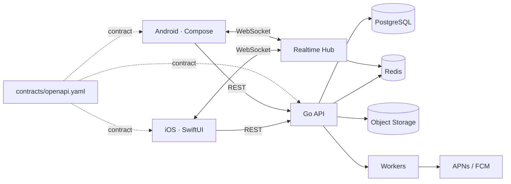

# PIXEL GO — Native Cross-Device Sharing

[English](README.md) · [Español](README.es.md)

> **SEND IT. PICK IT UP ANYWHERE.**  
> PIXEL GO is a cross-platform sharing system for moving **files, photos, links, text and clipboard content** between your own iPhone and Android devices — instantly, securely and natively.


## The product

AirDrop is excellent inside Apple's ecosystem. PIXEL GO explores the engineering problem that appears when the devices are **not** in the same ecosystem.

A user signs in, registers their devices and can send something from one device to another:

```text
iPhone                         Pixel

        PIXEL GO
        Copy / Send
           photo
             ↓
      encrypted transfer
             ↓
                               notification
                                    ↓
                               received ✓
```

The visible product is intentionally small. The engineering underneath is not.

PIXEL GO is designed around five ideas:

- two genuinely native clients;
- one versioned API contract;
- explicit delivery state;
- resilient background transfer;
- CI/CD that proves compatibility instead of merely listing it as a skill.

## Why two native clients?

PIXEL GO deliberately does **not** share UI code.

```text
                         PIXEL GO API
                              │
                       OpenAPI Contract
                         ↙          ↘
                 Swift client    Kotlin client
                      ↓               ↓
                  SwiftUI App     Compose App
```

That makes platform differences part of the project rather than something hidden behind a cross-platform abstraction.

| Concern | iOS | Android |
|---|---|---|
| Language | Swift | Kotlin |
| UI | SwiftUI | Jetpack Compose |
| Async | Swift Concurrency | Coroutines |
| Secure storage | Keychain | Android Keystore |
| Push | APNs | FCM |
| Background work | BackgroundTasks | WorkManager |
| Local persistence | Swift-native persistence boundary | Room boundary |
| Lifecycle | iOS scene/app lifecycle | Android activity/process lifecycle |

**Same product. Two native implementations.**

## Transfer lifecycle

The core happy path is intentionally explicit:

```text
sender
  │
  ├── POST /v1/transfers
  │        ↓
  │   upload authorization
  │        ↓
  ├── upload payload to object storage
  │        ↓
  │   POST /v1/transfers/{id}/uploaded
  │        ↓
backend emits transfer.ready
  │
  ├── WebSocket → destination when connected
  └── push       → destination when sleeping/offline
                           ↓
                    destination downloads
                           ↓
                    checksum validation
                           ↓
              POST /v1/transfers/{id}/complete
                           ↓
                    transfer.completed
                           ↓
                      Delivered ✓
```

Transfers are modeled as a state machine instead of a single upload endpoint:

```text
created → uploading → ready → downloading → completed
    └──────────────→ failed ←────────────────┘
```

The contract is designed to support idempotency, retries and clients that may remain on older app versions.

## Architecture



### Backend shape

PIXEL GO uses a **modular monolith** on purpose.

```text
server/
├── cmd/api/
└── internal/
    ├── auth/
    ├── devices/
    ├── transfers/
    ├── presence/
    ├── notifications/
    ├── files/
    └── platform/
```

The intended production infrastructure is:

- PostgreSQL for durable users, devices and transfer metadata;
- Redis for presence, ephemeral delivery state and rate limiting;
- S3-compatible object storage for payloads;
- WebSockets for connected-device delivery;
- APNs / FCM for sleeping devices;
- background workers for fan-out, retries and cleanup;
- signed URLs so application servers do not proxy large files;
- JWT access tokens with refresh-token rotation;
- idempotency keys for retry-safe writes;
- structured logs, health checks and metrics.

No fake fleet of microservices is required to demonstrate those boundaries.

## Repository layout

```text
pixelgo/
├── ios/                         # Swift / SwiftUI client
├── android/                     # Kotlin / Jetpack Compose client
├── server/                      # Go modular monolith
├── contracts/
│   └── openapi.yaml             # Source-of-truth HTTP contract
├── infrastructure/
│   ├── docker-compose.yml
│   └── postgres/
├── docs/
│   ├── ARCHITECTURE.md
│   ├── TRANSFER_LIFECYCLE.md
│   ├── SECURITY.md
│   └── LOCAL_DEVELOPMENT.md
├── tests/
│   └── e2e/
└── .github/
    └── workflows/
```

## API contract

`contracts/openapi.yaml` is the compatibility boundary between the three independently deployed pieces of software.

Core resources:

```text
POST   /v1/auth/register
POST   /v1/auth/login
POST   /v1/auth/refresh

GET    /v1/devices
POST   /v1/devices
DELETE /v1/devices/{deviceId}

POST   /v1/transfers
GET    /v1/transfers
GET    /v1/transfers/{transferId}
POST   /v1/transfers/{transferId}/uploaded
POST   /v1/transfers/{transferId}/complete

GET    /v1/events
```

A mobile API cannot assume every installed client updates immediately. Contract validation is therefore part of CI. An incompatible API change should fail before merge rather than break older phones in production.

## Native iOS client

The iOS client is organized around SwiftUI + Swift Concurrency.

Current foundation includes:

- SwiftUI app shell and device/recent-transfer UI;
- actor-based API client using `URLSession`;
- Keychain token storage;
- transfer domain models;
- notification permission boundary;
- BackgroundTasks registration point;
- test target generated with XcodeGen.

The project definition lives in `ios/project.yml`, keeping the Xcode project reproducible instead of committing machine-specific project metadata.

## Native Android client

The Android client uses Kotlin + Jetpack Compose with platform-native infrastructure.

Current foundation includes:

- Compose app shell and device/recent-transfer UI;
- coroutine-based API boundary;
- Android Keystore token encryption;
- WorkManager transfer worker boundary;
- Room-ready persistence module boundary;
- FCM-ready messaging dependency;
- JUnit foundation.

The two apps may share API semantics. They do **not** share UI implementation.

## Presence and delivery

A registered device has a durable identity and ephemeral presence.

```text
device registered
      ↓
WebSocket authenticated
      ↓
device.online
      ↓
heartbeat / reconnect
      ↓
device.offline
```

Presence is not treated as durable truth. PostgreSQL knows that a device exists; Redis can represent whether it appears reachable now.

Delivery uses two paths:

1. WebSocket for an active connected app.
2. Push notification as a wake-up signal when the destination is not actively connected.

The push payload should carry transfer metadata, not the file itself.

## Security model

PIXEL GO treats transfer content and device credentials as sensitive.

The architecture is built toward:

- TLS everywhere;
- short-lived access tokens;
- rotating refresh tokens;
- Keychain / Android Keystore for local credentials;
- signed upload/download URLs;
- SHA-256 payload integrity verification;
- file-size and content-type limits;
- rate limits per account/device/IP;
- idempotency for transfer mutations;
- object expiry and cleanup;
- no credentials committed to source control.

See [docs/SECURITY.md](docs/SECURITY.md).

## CI/CD

Pull requests are intended to prove that the three implementations still agree:

```text
PR
 ↓
Contract validation
 ↓
┌─────────────────────────────────┐
│                                 │
iOS tests                     Android tests
│                                 │
Swift build                   Gradle build
│                                 │
└───────────────┬─────────────────┘
                ↓
           Backend tests
                ↓
        Integration checks
                ↓
      Contract breaking check
                ↓
        Docker image build
                ↓
          Security checks
                ↓
              PASS ✓
```

Release flow is separated because backend and mobile have different deployment models:

```text
main
 ↓
backend image
 ↓
staging
 ↓
smoke tests
 ↓
production
```

```text
release tag
      ↓
 ┌────┴─────┐
 ↓          ↓
iOS      Android
 ↓          ↓
Archive   Bundle
 ↓          ↓
TestFlight / Internal testing
```

The repository contains workflow foundations under `.github/workflows/`. Store signing, App Store Connect and Play Console secrets are intentionally not fabricated.

## Testing strategy

The goal is not a huge count of trivial tests. The highest-value tests verify product invariants.

### iOS

- Swift Testing / XCTest;
- API decoding;
- repository behavior;
- transfer state transitions;
- UI smoke tests;
- network mocks.

### Android

- JUnit;
- coroutine/repository tests;
- Compose UI tests;
- WorkManager behavior;
- network mocks.

### Backend

- unit tests;
- transfer state machine tests;
- HTTP integration tests;
- auth tests;
- rate-limiting tests;
- WebSocket delivery tests;
- upload lifecycle tests.

### End-to-end target

```text
Create user
   ↓
Register iPhone
   ↓
Register Android
   ↓
Create transfer from iPhone
   ↓
Upload payload
   ↓
Receive Android event
   ↓
Download payload
   ↓
Validate checksum
   ↓
Mark delivered
   ↓
PASS
```

## Local development

Infrastructure services:

```bash
docker compose -f infrastructure/docker-compose.yml up -d
```

Backend:

```bash
cd server
cp .env.example .env
go test ./...
go run ./cmd/api
```

iOS:

```bash
cd ios
brew install xcodegen
xcodegen generate
open PixelGo.xcodeproj
```

Android:

```bash
cd android
gradle :app:testDebugUnitTest
gradle :app:assembleDebug
```

Full setup: [docs/LOCAL_DEVELOPMENT.md](docs/LOCAL_DEVELOPMENT.md).

## Current implementation

This repository is being built as an engineering portfolio project, so implementation status is kept explicit.

**Implemented foundation:**

- versioned OpenAPI contract;
- Go HTTP service with health, devices, transfer creation and transfer-state endpoints;
- in-process realtime event hub with a WebSocket endpoint;
- transfer state machine and checksum metadata;
- SwiftUI native client foundation;
- Compose native client foundation;
- Keychain and Android Keystore secure-storage boundaries;
- BackgroundTasks and WorkManager integration points;
- PostgreSQL schema;
- local PostgreSQL + Redis + MinIO environment;
- CI foundations for contract, backend, iOS and Android;
- bilingual engineering documentation.

**Next production milestones:**

- PostgreSQL repositories wired into runtime;
- Redis-backed distributed presence and rate limiting;
- signed S3/MinIO upload and download URLs;
- real APNs / FCM credentials and delivery adapters;
- refresh-token rotation persistence;
- generated Swift/Kotlin API clients from OpenAPI;
- full device-to-device E2E test in CI;
- App Store / Play internal distribution automation.

Real cloud credentials, signing certificates and production endpoints are intentionally not committed.

## Engineering thesis

PIXEL GO is intentionally narrower than a social network, map product or ML platform.

Its purpose is simple:

> **Send something from one device to another.**

That small surface makes room to go deep on the parts that are easy to fake in portfolio projects and difficult to execute well in real software: native platform behavior, backwards-compatible APIs, background execution, realtime delivery, secure storage, retries, CI/CD and end-to-end testing.

**One product. Two native apps. One contract.**
