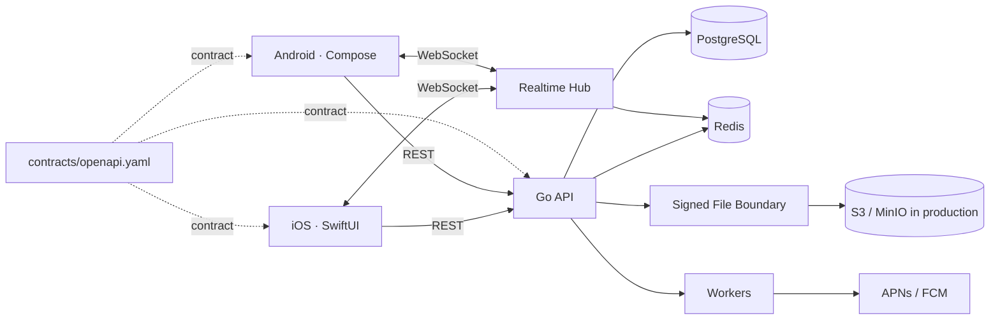

# PIXEL GO — Native Cross-Device Sharing

[English](README.md) · [Español](README.es.md)

> **SEND IT. PICK IT UP ANYWHERE.**  
> PIXEL GO is a cross-device sharing system for moving **files, photos, links, text and clipboard content** between iPhone and Android — with two independent native clients and one compatibility contract.


## The product

AirDrop is excellent when every device lives inside one ecosystem. PIXEL GO explores the engineering problem that appears when they do not.

```text
iPhone                                      Pixel

                PIXEL GO
                Copy / Send
                   photo
                     ↓
             signed upload URL
                     ↓
                 SHA-256
                     ↓
              transfer.ready
                     ├──────── WebSocket ────────→
                     └──────── push wake-up ────→
                                                   ↓
                                                download
                                                   ↓
                                             verify SHA-256
                                                   ↓
                                              Delivered ✓
```

The visible product is deliberately small. That leaves room to go deep on the engineering underneath: native lifecycle behavior, background work, retry safety, realtime delivery, binary transfer integrity, backwards-compatible contracts and CI/CD.

## One product. Two native apps.

PIXEL GO intentionally shares **no UI implementation** between platforms.

```text
                         PIXEL GO API
                              │
                       OpenAPI Contract
                         ↙          ↘
                 Swift client    Kotlin client
                      ↓               ↓
                  SwiftUI App     Compose App
```

| Concern | iOS | Android |
|---|---|---|
| Language | Swift | Kotlin |
| UI | SwiftUI | Jetpack Compose |
| Async | Swift Concurrency | Coroutines |
| Networking | URLSession | native HTTP boundary |
| Secure storage | Keychain | Android Keystore |
| Push boundary | APNs | FCM |
| Background work | BackgroundTasks | WorkManager |
| Local persistence | native persistence boundary | Room boundary |
| Lifecycle | app / scene lifecycle | activity / process lifecycle |

Both current app shells load registered devices, recent transfers and **Redis-backed Online / Offline presence** from the same Go API, while remaining independently implemented.

## Transfer lifecycle

Transfers are modeled as state, not as one giant upload request.

```text
created → uploading → ready → downloading → completed
    └──────────────→ failed ←────────────────┘
```

The current local end-to-end path is already executable:

```text
Register iPhone
     ↓
Register Android
     ↓
POST /v1/transfers
     ↓
receive expiring HMAC-signed upload URL
     ↓
PUT real payload bytes
     ↓
server verifies declared size + SHA-256
     ↓
POST /uploaded
     ↓
receive expiring signed download URL
     ↓
GET the same bytes
     ↓
verify SHA-256
     ↓
POST /complete
     ↓
Delivered ✓
```

For deterministic local development and CI, the payload adapter currently stores bytes in process memory behind signed URLs. The boundary is intentionally designed so production can replace that adapter with S3-compatible object storage without changing transfer-domain semantics.

## Retry safety

Mobile networks fail in ambiguous ways. A client can time out after the server successfully processed a request and have no idea whether retrying will duplicate the operation.

PIXEL GO therefore implements `Idempotency-Key` handling for POST mutations.

Current behavior:

- same key + same request → replay the original response;
- same key + different payload/path → `409 idempotency_key_reused`;
- concurrent retries with the same key are **coalesced**, so only one mutation executes;
- 5xx responses are not retained as successful idempotency records;
- replayed responses expose `Idempotency-Replayed: true`.

When Redis is configured, idempotency is **distributed across API replicas**. Redis coordinates an owner-scoped mutation lock and stores the replayable response for 24 hours. Two identical retries can land on different backend instances and still execute the mutation only once. If Redis is configured but unavailable, mutation idempotency fails closed with `503` rather than risking a duplicate write.

Without Redis, local/test mode keeps the same semantics with an in-process store.

## Architecture



### Why a modular monolith?

PIXEL GO does not use fake microservices for portfolio optics.

```text
server/
├── cmd/api/
└── internal/
    ├── devices/
    ├── transfers/
    ├── files/
    ├── realtime/
    └── httpapi/
```

The production architecture is intended to add explicit modules for auth, notifications, presence and platform adapters while keeping one deployable backend until scale gives a concrete reason to extract something.

Natural future extraction points are realtime connection handling and asynchronous workers — not arbitrary domain nouns.

### Durable vs. ephemeral state

PIXEL GO now makes the storage split executable rather than architectural-only:

- **PostgreSQL** stores durable devices and transfer metadata;
- **Redis presence TTLs** represent whether a device appears reachable now;
- **Redis Pub/Sub** fans realtime events across multiple API instances;
- **Redis idempotency** coordinates retry-safe mutations across replicas;
- **Redis rate limits** share request budgets across replicas;
- signed URLs are regenerated from transfer state and are **not persisted** as durable credentials.

CI runs the binary against real PostgreSQL + Redis and verifies that transfer metadata survives an API restart.

## Repository layout

```text
pixelgo/
├── ios/                         # Swift / SwiftUI
├── android/                     # Kotlin / Compose
├── server/                      # Go modular monolith
├── contracts/
│   └── openapi.yaml             # Compatibility contract
├── infrastructure/
│   ├── docker-compose.yml
│   └── postgres/
├── docs/
│   ├── ARCHITECTURE.md
│   ├── TRANSFER_LIFECYCLE.md
│   ├── SECURITY.md
│   └── LOCAL_DEVELOPMENT.md
├── tests/
│   └── e2e/
└── .github/
    └── workflows/
```

## API contract

`contracts/openapi.yaml` is the compatibility boundary between software that does not deploy at the same speed.

Current public API foundation:

```text
GET    /health

GET    /v1/devices
POST   /v1/devices
DELETE /v1/devices/{deviceId}
GET    /v1/presence/{deviceId}

POST   /v1/transfers
GET    /v1/transfers
GET    /v1/transfers/{transferId}
POST   /v1/transfers/{transferId}/uploaded
POST   /v1/transfers/{transferId}/complete

GET    /v1/events?deviceId=...    # WebSocket upgrade + presence identity
```

The development server also exposes signed `/dev-upload/{id}` and `/dev-download/{id}` routes as the local file adapter. Those are not intended to become the production file-storage API.

A mobile backend cannot assume every installed client updates immediately. CI therefore validates the OpenAPI structure and, on pull requests, runs a breaking-change check against the base contract.

## Native iOS

The iOS implementation currently includes:

- Swift 6 + SwiftUI;
- actor-based `URLSession` API client;
- real devices / recent transfers loaded from the API;
- Online / Offline state loaded from the Redis-backed presence endpoint;
- Keychain credential-storage boundary;
- BackgroundTasks coordinator;
- notification authorization boundary;
- transfer domain models;
- XCTest decoding coverage;
- reproducible Xcode project generation with XcodeGen;
- Swift 6 concurrency isolation rather than disabling safety checks.

## Native Android

The Android implementation currently includes:

- Kotlin + Jetpack Compose;
- Coroutines;
- real devices / recent transfers loaded from the same API;
- Online / Offline state loaded from the same Redis-backed presence endpoint;
- Android Keystore encryption boundary;
- WorkManager transfer-worker boundary;
- Room entity/persistence boundary;
- FCM dependency boundary;
- JUnit foundation;
- AndroidX explicitly configured in the build.

The two clients agree on product semantics. They do not share UI source code.

## Signed transfer security

The local signed-URL implementation uses HMAC-SHA256 over action, transfer ID and expiry.

A signed URL is scoped to:

- one transfer;
- one action: upload or download;
- a short expiration window.

The local upload path additionally verifies:

1. the transfer is still accepting an upload;
2. byte count exactly matches declared `sizeBytes`;
3. SHA-256 exactly matches transfer metadata.

Only after a valid payload exists can the transfer transition to `ready`.

This is not end-to-end encryption yet. The current checksum proves payload integrity, while TLS protects transport. End-to-end content encryption remains a separate future security milestone.

See [docs/SECURITY.md](docs/SECURITY.md).

## CI/CD

Every push / pull request validates the project as multiple independently built systems:

```text
                         PR / PUSH
                             ↓
                 OpenAPI structural validation
                             ↓
              ┌──────────────┼──────────────┐
              ↓              ↓              ↓
        SwiftUI tests    Compose tests     Go vet
        iOS build        Android build     Go -race tests
              │              │              ↓
              │              │       binary E2E lifecycle
              └──────────────┴──────────────┤
                                             ↓
                                      Docker image build
```

On pull requests, the contract job additionally checks for incompatible OpenAPI changes.

Release tags produce independent backend, Android and iOS artifacts. Store signing and real production deployment credentials are intentionally not fabricated in source control.

## Tests that matter

The project prioritizes product invariants over test-count vanity.

Implemented backend/E2E coverage now includes:

- transfer state transitions;
- cannot complete before ready;
- HMAC signed URL verification;
- signed URL tamper rejection;
- immutable payload storage semantics;
- sequential idempotent replay;
- conflicting idempotency-key reuse;
- concurrent retry coalescing;
- retry after server failure;
- real upload of payload bytes;
- upload byte-count validation boundary;
- SHA-256 integrity validation;
- real download of the same bytes;
- final delivered state;
- PostgreSQL persistence across an API process restart;
- Redis presence TTL lifecycle;
- Redis Pub/Sub event fan-out;
- idempotency across independent handlers / replica boundaries;
- shared Redis request budgets;
- HTTP `429` + `Retry-After` rate-limit behavior.

The E2E currently simulates the iPhone/Android roles through the HTTP API in CI; it does **not** claim physical-device automation yet.

## Local development

Start optional infrastructure:

```bash
docker compose -f infrastructure/docker-compose.yml up -d
```

Run the backend:

```bash
cd server
cp .env.example .env
go mod tidy
go test ./...
go run ./cmd/api
```

With the API running, exercise the real local transfer lifecycle:

```bash
python3 tests/e2e/transfer_flow.py
```

iOS:

```bash
cd ios
brew install xcodegen
xcodegen generate
open PixelGo.xcodeproj
```

Android:

```bash
cd android
gradle :app:testDebugUnitTest
gradle :app:assembleDebug
```

Full setup: [docs/LOCAL_DEVELOPMENT.md](docs/LOCAL_DEVELOPMENT.md).

## Current implementation

**Implemented now:**

- versioned OpenAPI contract;
- native SwiftUI application foundation;
- native Compose application foundation;
- both clients reading the same backend state and live presence;
- Go HTTP modular-monolith foundation;
- explicit transfer state machine;
- WebSocket realtime event hub;
- HMAC-signed upload/download URLs with expiry;
- real local binary upload/download path;
- byte-count and SHA-256 validation;
- retry-safe idempotency with concurrent coalescing;
- Keychain / Android Keystore boundaries;
- BackgroundTasks / WorkManager boundaries;
- PostgreSQL runtime repositories for durable devices/transfers;
- persistence verified across API restart;
- Redis-backed presence with TTL heartbeats;
- Redis Pub/Sub distributed realtime fan-out;
- Redis-backed cross-replica idempotency;
- shared Redis rate limiting with `429` / `Retry-After`;
- local PostgreSQL + Redis + MinIO environment;
- cross-platform CI;
- real binary E2E lifecycle in CI;
- release-artifact workflows;
- bilingual engineering documentation.

**Still intentionally not claimed as complete:**

- user authentication and refresh-token rotation;
- production S3/MinIO signed-URL adapter;
- real APNs / FCM delivery adapters;
- generated Swift/Kotlin clients from OpenAPI;
- physical iPhone → Android automated E2E;
- App Store / Play internal distribution with real credentials.

## Engineering thesis

PIXEL GO is intentionally narrower than a social network, map product or ML platform.

Its purpose is simple:

> **Send something from one device to another.**

That small product surface creates space to demonstrate the engineering details that are easy to list on a résumé and much harder to implement coherently: native platforms, background execution, compatibility contracts, retries, realtime delivery, binary integrity, secure storage boundaries, testing and CI/CD.

**One product. Two native apps. One contract.**
