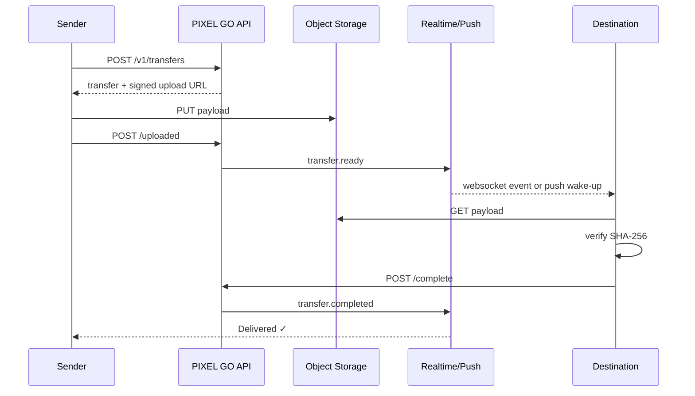

# Architecture

PIXEL GO is a modular monolith with two independently implemented native clients.

## Principles

1. Native clients own native UX and lifecycle behavior.
2. The OpenAPI document is the compatibility boundary.
3. Binary payloads bypass the application server whenever possible.
4. Durable state and ephemeral presence are different data classes.
5. Delivery is at-least-once at the event layer and idempotent at mutation boundaries.
6. Mobile clients must tolerate server evolution and temporary offline periods.

## Components

### iOS
SwiftUI renders the product. Swift Concurrency coordinates API work. Keychain stores session credentials. BackgroundTasks provides a scheduled recovery boundary. APNs will wake a sleeping client when realtime delivery is unavailable.

### Android
Jetpack Compose renders the product. Coroutines coordinate API work. Android Keystore protects local credential material. WorkManager owns deferrable/retryable background work. FCM will provide wake-up notifications.

### API
The Go service owns authentication, device registration, transfer metadata and authorization decisions. It should not proxy large files through application memory.

### PostgreSQL
Runtime source of truth for registered devices and transfer metadata. The API can fall back to in-memory repositories when `DATABASE_URL` is absent, but CI runs against PostgreSQL and proves state survives a backend restart. The schema also reserves the user/auth boundary for the next milestone.

### Redis
Runtime source of truth for ephemeral coordination when `REDIS_URL` is configured:

- device presence with TTL heartbeats;
- Pub/Sub event fan-out across API replicas;
- cross-replica idempotency locks + replay records;
- shared fixed-window API rate limits.

The application retains in-memory adapters for isolated local tests.

### Object storage
Payload bytes. Objects are addressed by opaque keys and accessed through short-lived signed URLs.

### Workers
Push fan-out, retry queues, orphan cleanup, expiry and other work that should not block request latency.

## Request path



## State ownership

```text
PostgreSQL
  ├── registered devices
  └── transfer metadata / lifecycle

Redis
  ├── presence TTL
  ├── realtime Pub/Sub
  ├── idempotency coordination
  └── shared rate-limit counters

File adapter
  └── payload bytes
```

Signed upload/download URLs are derived from transfer state and deliberately not persisted as durable credentials.

## Scaling path

The project starts as a modular monolith because domain boundaries can be explicit without paying distributed-system cost early.

If realtime connection volume later requires independent scaling, the realtime gateway is the first natural extraction point. Workers are another independent scaling boundary. The durable domain API can remain a monolith much longer.

That is a scaling path, not a requirement for the first release.
